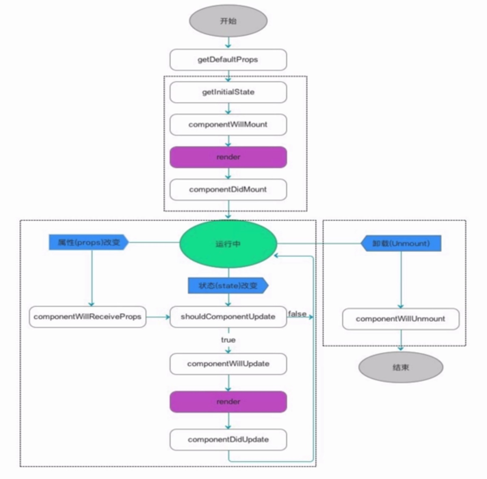

### 生命周期钩子

三大阶段：

挂载

更新

卸载

### React中数据`不可变性`的重要性

[https://react.docschina.org/tutorial/tutorial.html#why-immutability-is-important](https://react.docschina.org/tutorial/tutorial.html#why-immutability-is-important)

❓有些什么缺点啦？

